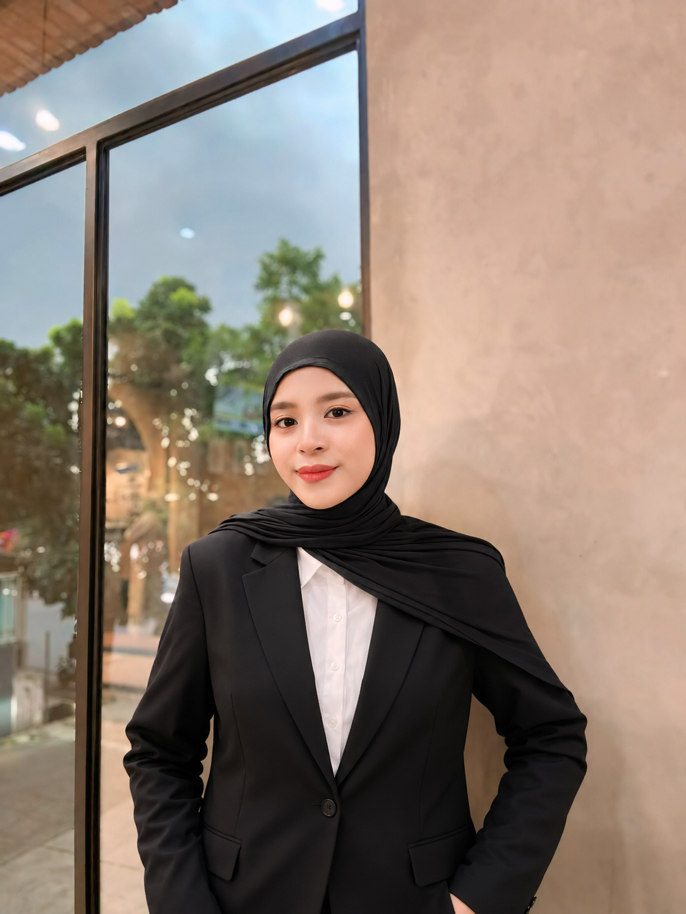

<div align="center">

# 🌐 Syifa Amara Dhestyani Portfolio

<i>
Computer Engineering Graduate | Software Engineer | Mobile Developer | Cybersecurity & DevSecOps Enthusiast
</i>

<br/>

<p align="center">
  <a href="https://your-portfolio.vercel.app">
    
  </a>

  <a href="https://github.com/yourusername/portfolio">
    
  </a>

</p>

<p align="center">
  <a href="#about">About</a> •
  <a href="#tech-stack">Tech Stack</a> •
  <a href="#featured-projects">Projects</a> •
  <a href="#run-locally">Run Locally</a> •
  <a href="#contact">Contact</a>
</p>

</div>

---

# About

Welcome to my personal portfolio website.

This portfolio showcases my projects, technical skills, internship experiences, research activities, publications, and achievements throughout my academic journey as a Computer Engineering graduate from Telkom University.

My interests include:

- Software Engineering
- Mobile Development
- Backend Development
- Cybersecurity
- DevSecOps
- Data Analytics

---

# Tech Stack

### Frontend

- Next.js
- TypeScript
- Tailwind CSS
- Framer Motion

### Backend

- Firebase Realtime Database
- SendGrid

### Deployment

- Vercel

---

# Featured Projects

### 🔐 Automated Mobile SAST & DAST System
Automated security testing pipeline for Android applications using MobSF, OWASP ZAP, Jenkins, Docker, and Android Emulator.

### ⚡ JAGA GRID
Mobile application developed during internship at PLN UP3 Makassar for monitoring vegetation around electrical power lines using Flutter and Firebase.

### 📂 Document Management System (DMS)
Backend web application developed using CodeIgniter 4 and MySQL during internship at Yan CeLOE, featuring document management, authentication, RBAC, and approval workflows.

### 🧺 Amara Laundry Management System
Laundry management system developed using PHP and MySQL with separate Operator and Member portals.

### 🎨 Borcelle Beautyverse
Modern beauty shopping mobile UI/UX designed using Figma with interactive prototype.

---

# Run Locally

Clone the project

```bash
git clone https://github.com/yourusername/portfolio.git
```

Go to the project directory

```bash
cd portfolio
```

Install dependencies

```bash
npm install
```

Create a `.env.local` file

```env
SENDGRID_API_KEY=YOUR_API_KEY
NEXT_PUBLIC_FIREBASE_DATABASE_URL=YOUR_DATABASE_URL
MAIL_FROM=YOUR_EMAIL
MAIL_TO=YOUR_EMAIL
```

Run development server

```bash
npm run dev
```

Open

```
http://localhost:3000
```

---

# Contact

📧 Email : your-email@gmail.com

💼 LinkedIn : https://linkedin.com/in/your-linkedin

🐙 GitHub : https://github.com/yourusername

🌐 Portfolio : https://your-portfolio.vercel.app

---

## License

This project is created for my personal portfolio and is available for viewing and inspiration.